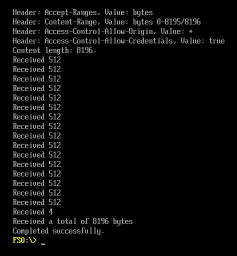

# Introduction

Bare metal [TianoCore EDK2](https://github.com/tianocore/edk2) bindings for Rust UEFI applications.
Nightly Rust only.

Credits to Alex Ionescu, glue was stolen from [VisualUefi](https://github.com/ionescu007/VisualUefi)

# Building without bothering about deps

- [Install nix](https://nix.dev/tutorials/install-nix)
- [Install Nix Flakes (highly likely Non-NixOS section)](https://nixos.wiki/wiki/Flakes)

- Enter in the matrix shell using: `nix develop`

### From within the shell

- OPTIONALLY update edk2 + regenerate bindings using the command: `update`
- Within the shell, you should be able to run `cargo build --release`

# Example in action

